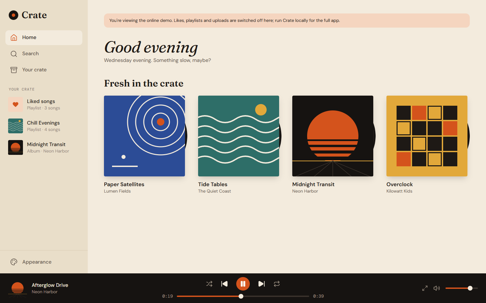
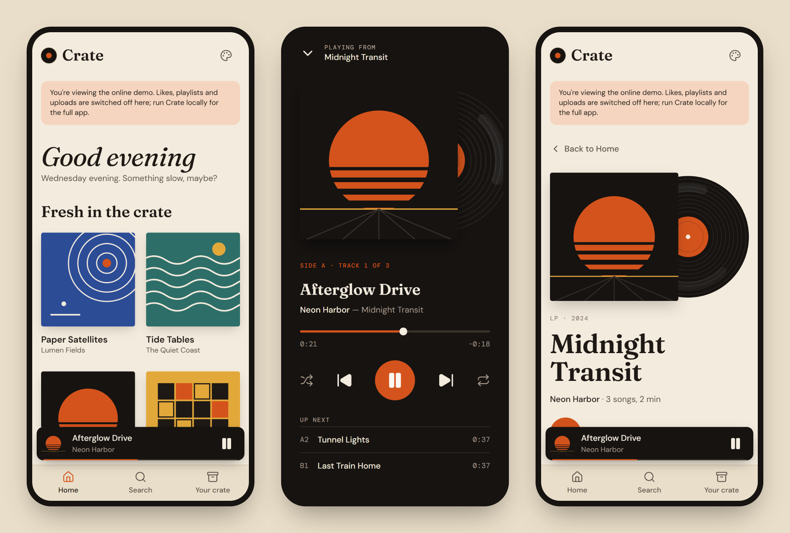
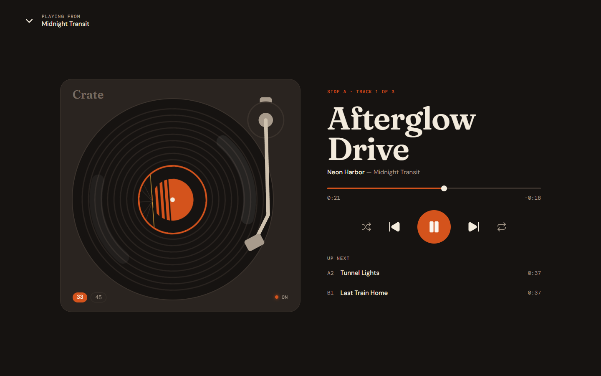
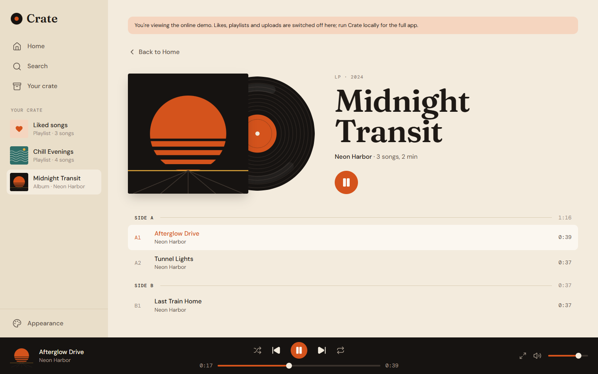
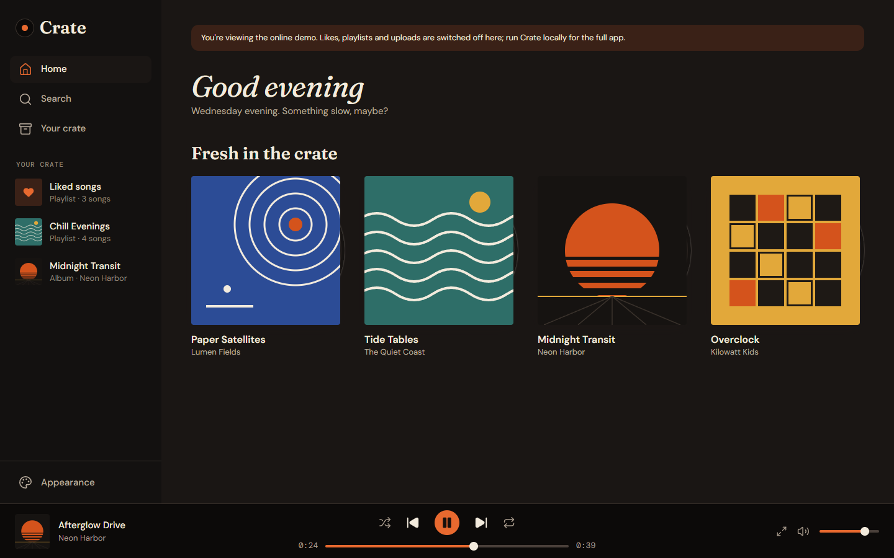
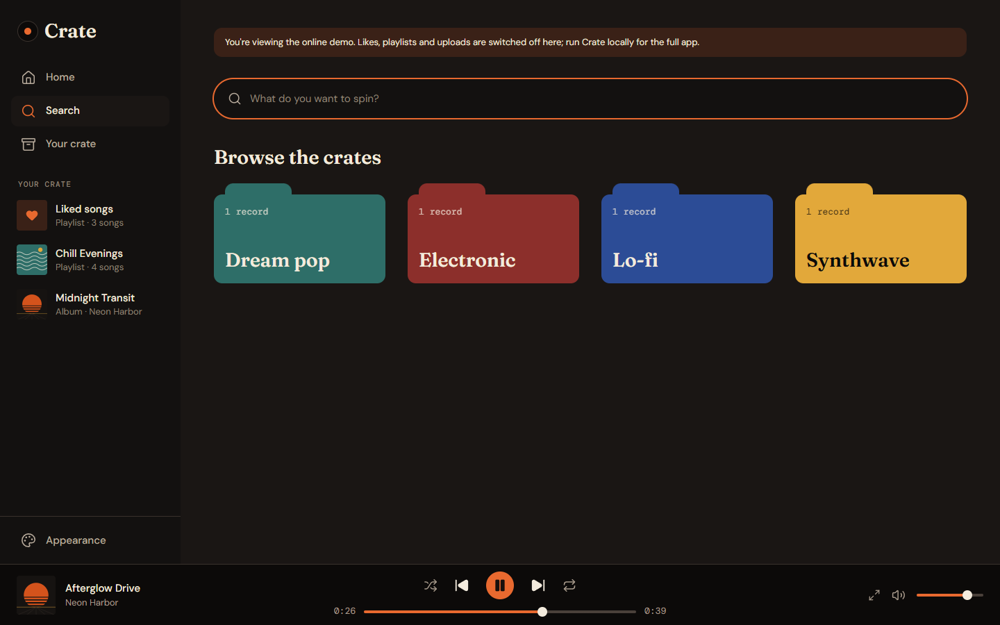

# Crate

A record-shop take on a music player. Crate is a Spotify-style web app for browsing albums, playing music, searching, liking songs and building playlists, wrapped in a warm, vinyl-inspired design: records slide out of their sleeves, tracks are numbered by side (A1, B2), and the player sits on a dark turntable deck.

**Live demo:** https://crate-red-two.vercel.app





## Features

- **Browse** albums and artists. Album pages list tracks by side, like the back of a record sleeve.
- **Playback** with play/pause, next/previous, seeking, volume, shuffle and repeat. The player keeps going while you move around the app.
- **Now Playing**, a full-screen turntable: the record spins at 33⅓ rpm with the album art on its label, and the tonearm lifts off when you pause.
- **Search** across artists, albums, songs and genres, with a "Top result" and genre "crate dividers" to browse.
- **Your crate**: liked songs, saved albums and playlists you can create, rename, delete and add songs to.
- **Uploads**: drop in an audio file and Crate reads its title, artist, album, year and cover art from the file's tags.
- **Appearance**: light, dark or automatic mode, plus five accent colors.
- **Responsive** layouts for phones (mini player and tab bar), tablets (icon rail) and desktops.
- A greeting that follows the time of day, in the visitor's own time zone.

## Screenshots

### Now Playing



### Album page



### Dark mode

| Home | Search |
| --- | --- |
|  |  |

## How it's built

| Part | Tech |
| --- | --- |
| Framework | Next.js (App Router), React and TypeScript |
| Styling | Tailwind CSS v4, with the design's colors and type as tokens (CSS variables) that switch for dark mode and accents |
| Data | A JSON catalog read on the server; Server Actions save likes, playlists and uploads |
| Audio | One `<audio>` element owned by a React context (`PlayerProvider`), so playback survives page changes |
| Icons and fonts | Lucide icons; Fraunces, DM Sans and DM Mono via `next/font` |
| Design | Designed in Figma first: cream paper, ink-dark type, one accent color and a vinyl motif |
| Hosting | Vercel, deploying automatically from `main` |

## Getting started

You'll need Node.js 20.9 or newer.

```bash
git clone https://github.com/sean-birmingham/crate.git
cd crate
npm install
npm run dev
```

Then open http://localhost:3000. Crate comes with a demo catalog of 12 original songs, so it works straight away.

### Using your own music

- **Upload page:** go to `/upload` and drop in a file. Crate reads its tags and cover art, and saves the file to `public/uploads/`.
- **By hand:** put audio files in `public/music/` and describe them in `data/db.local.json`, using the same shape as `data/db.json`.

When `data/db.local.json` exists, Crate uses it instead of the demo catalog, and saves your likes, playlists and uploads there. That file, `public/music/` and `public/uploads/` are all ignored by Git, so your personal library stays on your computer.

### Demo mode

Set `NEXT_PUBLIC_READ_ONLY=true` to switch off everything that saves data. The hosted demo uses this, because Vercel can't write files; everything else, including playback and the appearance settings, still works.

## Project structure

```
app/                 Pages (Home, Album, Artist, Search, Your crate, Liked songs, Playlist, Upload) and the root layout
components/          Interface pieces: Sidebar, PlayerBar, MobileDock, TrackList, AlbumCard, AppearanceMenu…
components/player/   PlayerProvider (audio and queue), Now Playing, Turntable
lib/                 Types, reading data (db.ts), Server Actions (actions.ts), theme, formatting
data/                db.json (demo catalog) · db.local.json (your library, not in Git)
public/              covers/, demo/ (demo songs) · music/ and uploads/ (not in Git)
```

## Roadmap

- [ ] Accounts and cloud storage with Supabase, so likes, playlists and uploads work online
- [ ] Keyboard shortcuts and media-key support
- [ ] Queue panel and "recently played"
- [ ] Optional Spotify mode

## Credits

- Built with [Claude](https://claude.ai) (Anthropic) as a coding guide.
- The demo songs, album artwork and original Figma design were generated with Claude for this project, so they're free of third-party copyright.
- Fonts: Fraunces, DM Sans and DM Mono from Google Fonts (SIL Open Font License).
- Icons: Lucide (ISC License).
